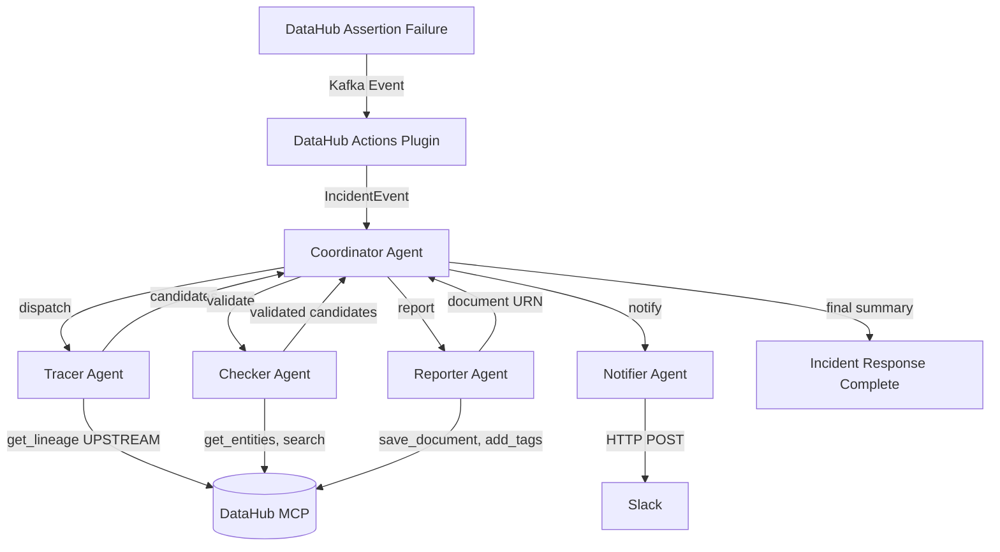

# Data Incident Response Agent

An event-driven multi-agent system that listens for DataHub assertion failures, traces upstream lineage to identify root cause, validates hypotheses, and writes incident reports back to DataHub.

Built for the DataHub Hackathon.

## Problem

When a data quality assertion fails, data teams spend hours manually tracing lineage, checking upstream datasets, and identifying the root cause. Mean Time To Resolution (MTTR) for data incidents is typically measured in hours.

## Solution

An autonomous agent system that:
1. **Detects** assertion failures in real-time via DataHub Actions (event-driven)
2. **Traces** upstream lineage using `get_lineage` and `get_lineage_paths_between`
3. **Validates** candidate root causes by checking assertions, schema changes, and freshness
4. **Notifies** the team via Slack with actionable alerts
5. **Reports** incident findings back to DataHub as documents

MTTR: ~45 seconds vs ~4 hours manual.

## Architecture



## Agent Topology

- **Coordinator** — Orchestrates the pipeline, dispatches to sub-agents, aggregates results
- **Tracer** — Retrieves upstream lineage (up to 3 hops), evaluates each node for root cause indicators (failed assertions, schema changes, freshness issues), returns ranked candidates with confidence scores
- **Checker** — Validates each candidate by examining metadata, checking for failed assertions, schema modifications, and related documents. Returns confirmed/probable/rejected status. Optionally uses LLM reasoning to adjust confidence
- **Notifier** — Formats a Slack alert with dataset name, assertion details, root cause candidates, confidence scores, and DataHub UI link
- **Reporter** — Generates a markdown incident report (summary, root cause analysis, lineage path, recommended actions) and writes it back to DataHub as a document. Tags root cause datasets

## LLM Support

The Checker agent can use an LLM to reason about root cause candidates. Any one of the following providers is supported (checked in this order):

| Provider | Env Var | Default Model |
|----------|---------|---------------|
| Anthropic | `ANTHROPIC_API_KEY` | `claude-3-5-sonnet-20241022` |
| OpenAI | `OPENAI_API_KEY` | `gpt-4o` |
| Google | `GOOGLE_API_KEY` | `gemini-flash-lite-latest` |

If no API key is set, agents fall back to heuristic-only mode (still functional, just no LLM reasoning enrichment).

## DataHub Capabilities Used

- DataHub Actions (event-driven automation)
- MCP Server (mutations enabled) — used in-process via FastMCP
- DataHub Skills (lineage, quality, enrich)
- `get_lineage` (multi-hop UPSTREAM)
- `get_lineage_paths_between` (precise A-to-B path finding)
- `search` (entity discovery)
- `get_entities`, `list_schema_fields`
- `save_document`, `add_tags`, `update_description` (write-back)

## Prerequisites

1. **DataHub** running with Docker Compose quickstart:
   ```bash
   git clone https://github.com/datahub-project/datahub.git
   cd datahub
   docker compose -p datahub -f docker-compose.yml -f docker-compose.quickstart.yml up -d
   ```
   - GMS on `http://localhost:8080`
   - Frontend on `http://localhost:9002`
   - Kafka on `localhost:9092`

2. **DataHub access token** — generate from DataHub UI: Settings > Access Tokens

3. **Python 3.11+**

## Quick Start

```bash
# Clone
git clone https://github.com/Sektorial12/data-incident-response-agent.git
cd data-incident-response-agent/code

# Copy env and fill in values
cp .env.example .env
# Edit .env — at minimum set DATAHUB_ACCESS_TOKEN and DATAHUB_SERVICE_ACCOUNT_TOKEN

# Install
pip install -e .

# Run tests (126 tests)
python -m pytest tests/ -v

# Start the agent (launches DataHub Actions listener)
python src/main.py
```

The agent now listens for assertion failure events on Kafka. When an assertion fails, the full pipeline executes automatically.

### Docker

```bash
# Build
docker build -t data-incident-response-agent .

# Run (pass env vars at runtime)
docker run --rm --network host \
  -e DATAHUB_ACCESS_TOKEN=your_token \
  -e DATAHUB_SERVICE_ACCOUNT_TOKEN=your_token \
  -e GOOGLE_API_KEY=your_key \
  -e SLACK_WEBHOOK_URL=your_webhook \
  data-incident-response-agent
```

`--network host` is needed so the container can reach DataHub on localhost.

### Docker Compose (Agent + Dashboard)

```bash
# Build and run both agent and dashboard
docker-compose up --build

# Dashboard available at http://localhost:8081
# API available at http://localhost:8000
```

### Dashboard

A React dashboard provides real-time visibility into incidents:

- **Incident feed** — live list of active/resolved incidents with confidence bars
- **Agent pipeline timeline** — Tracer -> Checker -> Notifier -> Reporter with status
- **Root cause visualization** — ranked candidates with confidence levels
- **MTTR metrics** — resolution rate, average time to resolve, throughput

```bash
# Development mode
cd dashboard && npm install && npm run dev

# Production (served via nginx in Docker)
docker-compose up --build
```

The dashboard polls the agent's FastAPI server at `/incidents`, `/stats`, and `/health`.

### API Endpoints

| Endpoint | Description |
|----------|-------------|
| `GET /health` | Liveness probe with uptime |
| `GET /metrics` | Prometheus-style metrics (incidents, agent duration, LLM calls) |
| `GET /incidents?status=active&limit=50` | List incidents, optionally filtered by status |
| `GET /incidents/{id}` | Single incident detail with agent results and root causes |
| `GET /stats` | Aggregate metrics (total, active, resolved, avg MTTR) |

## Configuration

### `.env` file

| Variable | Required | Description |
|----------|----------|-------------|
| `DATAHUB_SERVER_URL` | yes | GMS URL (default: `http://localhost:8080`) |
| `DATAHUB_FRONTEND_URL` | yes | Frontend URL (default: `http://localhost:9002`) |
| `DATAHUB_ACCESS_TOKEN` | yes | Personal access token |
| `DATAHUB_SERVICE_ACCOUNT_TOKEN` | yes | Service account token for MCP server |
| `TOOLS_IS_MUTATION_ENABLED` | yes | Must be `true` for write-back (tags, documents) |
| `SLACK_WEBHOOK_URL` | no | Slack incoming webhook for alerts (default route) |
| `SLACK_CRITICAL_WEBHOOK_URL` | no | Slack webhook for critical platform alerts (routing) |
| `SLACK_HIGH_PRIORITY_WEBHOOK_URL` | no | Slack webhook for high-confidence incidents (routing) |
| `ANTHROPIC_API_KEY` | no | Anthropic API key (highest priority) |
| `OPENAI_API_KEY` | no | OpenAI API key |
| `GOOGLE_API_KEY` | no | Google Gemini API key (lowest priority) |
| `API_PORT` | no | Port for API server (default: 8000) |

### Config files

- `config/actions_config.yaml` — DataHub Actions plugin config (Kafka source, event filter, callback)
- `config/agent_config.yaml` — Agent settings (lineage hops, confidence thresholds, timeouts)
- `config/datahub_config.yaml` — DataHub connection settings

## Demo

1. DataHub running with healthcare dataset, assertions configured
2. Trigger: insert NULL into patient_id column
3. Agent detects assertion failure via DataHub Actions
4. Tracer agent traces 3-hop upstream lineage to find root cause
5. Checker agent validates hypothesis (with LLM reasoning if configured)
6. Slack alert sent with root cause + lineage path
7. Incident report written to DataHub

## Testing

```bash
# Run all 126 tests
python -m pytest tests/ -v

# Run specific agent tests
python -m pytest tests/test_tracer.py -v
python -m pytest tests/test_checker.py -v
python -m pytest tests/test_e2e.py -v
```

Test coverage:
- **Actions Plugin** (16 tests) — Event filtering, incident extraction, callback dispatch
- **Coordinator** (9 tests) — Agent message protocol, dispatch, error handling
- **Tracer Agent** (11 tests) — Lineage parsing, candidate scoring, path finding
- **Checker Agent** (8 tests) — Validation rules, confidence scoring, rejection
- **Notifier + Reporter** (11 tests) — Alert formatting, Slack webhook, report generation, document save, tag application
- **E2E Pipeline** (9 tests) — Full pipeline integration, agent failure resilience
- **LLM Integration** (13 tests) — Model-agnostic client, heuristic fallback, confidence adjustment
- **Edge Cases** (9 tests) — Retry/timeout, update_description, malformed events, empty lineage
- **Skills Loader** (6 tests) — DataHub skill guidance loading, prompt augmentation, fallback
- **Incident Store** (13 tests) — SQLite persistence, save/update/list, dedup lookup, metrics
- **API Server** (10 tests) — Health, metrics, incidents list/filter, stats, dedup integration
- **Alert Router** (11 tests) — Platform/confidence matching, env var resolution, edge cases

## License

Apache 2.0
