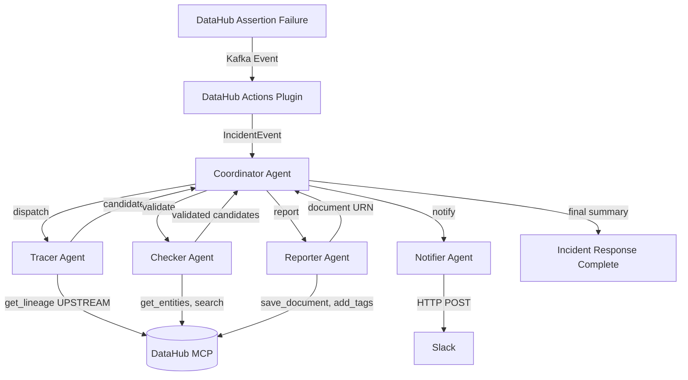

# Data Incident Response Agent

An event-driven multi-agent system that listens for DataHub assertion failures, traces upstream lineage to identify root cause, validates hypotheses, and writes incident reports back to DataHub.

Built for the DataHub Hackathon.

## Problem

When a data quality assertion fails, data teams spend hours manually tracing lineage, checking upstream datasets, and identifying the root cause. Mean Time To Resolution (MTTR) for data incidents is typically measured in hours.

## Solution

An autonomous agent system that:
1. **Detects** assertion failures in real-time via DataHub Actions (event-driven)
2. **Traces** upstream lineage using `get_lineage` and `get_lineage_paths_between`
3. **Validates** candidate root causes by checking assertions, schema changes, and freshness
4. **Notifies** the team via Slack with actionable alerts
5. **Reports** incident findings back to DataHub as documents

MTTR: ~45 seconds vs ~4 hours manual.

## Architecture



## Agent Topology

- **Coordinator** — Orchestrates the pipeline, dispatches to sub-agents, aggregates results
- **Tracer** — Retrieves upstream lineage (up to 3 hops), evaluates each node for root cause indicators (failed assertions, schema changes, freshness issues), returns ranked candidates with confidence scores
- **Checker** — Validates each candidate by examining metadata, checking for failed assertions, schema modifications, and related documents. Returns confirmed/probable/rejected status
- **Notifier** — Formats a Slack alert with dataset name, assertion details, root cause candidates, confidence scores, and DataHub UI link
- **Reporter** — Generates a markdown incident report (summary, root cause analysis, lineage path, recommended actions) and writes it back to DataHub as a document. Tags root cause datasets

## DataHub Capabilities Used

- DataHub Actions (event-driven automation)
- MCP Server (15+ tools, mutations enabled)
- DataHub Skills (lineage, quality, enrich)
- `get_lineage` (multi-hop UPSTREAM)
- `get_lineage_paths_between` (precise A-to-B path finding)
- `search` with SQL-like filters
- `get_entities`, `list_schema_fields`
- `save_document`, `add_tags`, `update_description` (write-back)
- `search_documents` (existing incident search)
- Service Accounts with Default Views

## Quick Start

```bash
# Clone
git clone https://github.com/Sektorial12/data-incident-response-agent.git
cd data-incident-response-agent

# Copy env
cp .env.example .env
# Edit .env with your credentials

# Install dependencies
pip install -r requirements.txt

# Run
python src/main.py
```

## Docker

```bash
docker-compose up -d
```

## Demo

1. DataHub running with healthcare dataset, assertions configured
2. Trigger: insert NULL into patient_id column
3. Agent detects assertion failure via DataHub Actions
4. Tracer agent traces 3-hop upstream lineage to find root cause
5. Checker agent validates hypothesis
6. Slack alert sent with root cause + lineage path
7. Incident report written to DataHub

## Testing

```bash
# Run all 92 tests
python -m pytest tests/ -v

# Run specific agent tests
python -m pytest tests/test_tracer.py -v
python -m pytest tests/test_checker.py -v
python -m pytest tests/test_e2e.py -v
```

Test coverage:
- **Actions Plugin** (16 tests) — Event filtering, incident extraction, callback dispatch
- **Coordinator** (9 tests) — Agent message protocol, dispatch, error handling
- **Tracer Agent** (9 tests) — Lineage parsing, candidate scoring, path finding
- **Checker Agent** (8 tests) — Validation rules, confidence scoring, rejection
- **Notifier Agent** (5 tests) — Alert formatting, Slack webhook, error handling
- **Reporter Agent** (7 tests) — Report generation, document save, tag application
- **E2E Pipeline** (9 tests) — Full pipeline integration, agent failure resilience
- **LLM Integration** (13 tests) — Model-agnostic client, heuristic fallback, confidence adjustment
- **Edge Cases** (9 tests) — Retry/timeout, update_description, malformed events, empty lineage
- **Skills Loader** (6 tests) — DataHub skill guidance loading, prompt augmentation, fallback

## License

Apache 2.0
